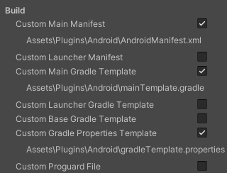

# Android Plugin

## Unity 中安卓插件的地雷

官方網站並沒有描述，當使用`.aar`檔案的時候會需要注意幾點

### Custom Gradle Properties Template

1. 要補述在`**ADDITIONAL_PROPERTIES**`之下
```properties
**ADDITIONAL_PROPERTIES**
# 改變 Unity 原本找 Java 檔案的位置的參數
android.overridePathCheck=true
# 改變 Unity 原本輸出 Android APK 不想用 Androidx 的命名空間
android.useAndroidX=true 
android.enableJetifier=true
```

2. 要更改`android.enableR8`從`**MINIFY_WITH_R_EIGHT**`到`true`
```properties
# 這個會編譯錯誤
android.enableR8=**MINIFY_WITH_R_EIGHT**
# 從上面改成下面
android.enableR8=true
```
### Custom Main Gradle Template

加上依賴，用到什麼加什麼！
```postcss
dependencies { 
          implementation fileTree(dir: 'libs', include: ['*.jar']) 
          // 這是用到的依賴  
          implementation 'androidx.appcompat:appcompat:1.2.0'
      **DEPS**}
```
### Custom Main Manifest

不用多寫什麼，但需要這個檔案

## 打勾的要是以下這些選項

記得要編輯更改以上項目<br>
