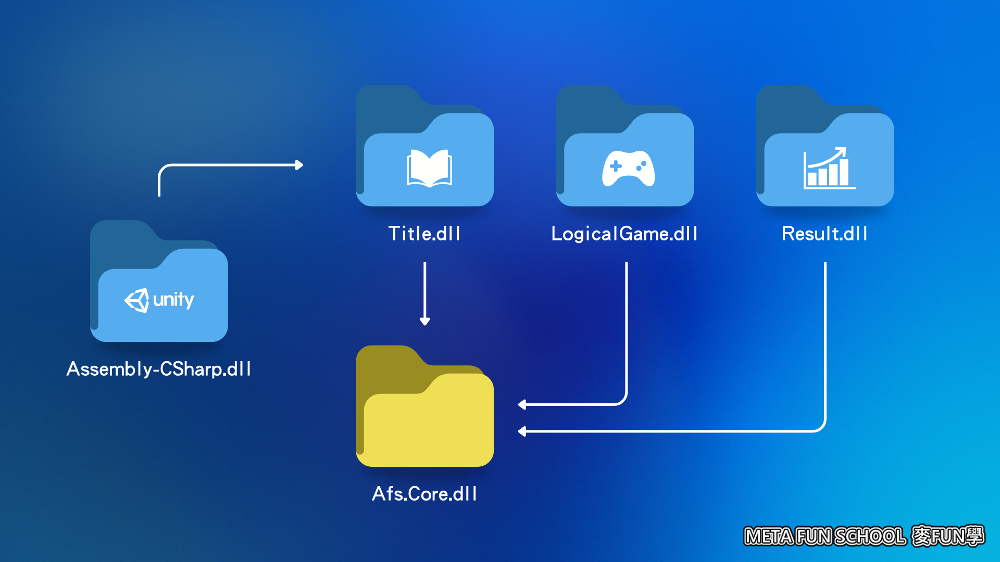

# 管理依賴？

問題

1. 是否有遇到「想要重複利用的腳本」，卻因為依賴無法搬到另一個專案？
2. 是否有遇到「想要更新舊的腳本」，卻因為依賴不能更新功能？
3. 是否有遇到「想要寫更好的方法」，卻因為依賴不能再寫一次？

解套方法

- 開始使用`AssemblyDefinition`！
  讓新的腳本限制自己能依賴誰，而不是全部！
- 讓舊的腳本決定被誰依賴，不再依賴外部完成自己的功能！

重要概念
- 當腳本增加引用，就會減少他們重複可利用性。

## 原理

### 介紹 AssemblyDefinition

`AssemblyDefinition`是一個`🧱.asmdef`檔案，
`UnityEditor`在建置輸出或稱`Build`的時候，它會把所有的腳本編譯成為一個龐大的`🛞Assembly-CSharp.dll`
這個`🛞.dll`檔案就是我們所謂的`Assembly`中文叫做`組件`。遊戲的運行都靠這個組件提供的功能與定義。
當我們使用`🧱.asmdef`時，可以命令`UnityEditor`對某些腳本獨立製作出`🛞.dll`。
如此一來，我們可以確保獨立製作出來的`🛞.dll`不會胡亂參考別的地方的腳本，也增加了這個獨立製作出的`🛞.dll`重複利用性。

### 思考方式

左邊的`🛞Assembly-CSharp.dll`是遊戲主要的`🛞.dll`，沒有`🧱.asmdef`的，都位於此。
而它透過箭頭關係依賴`🛞Title.dll`、`🛞LogicalGame.dll`、`🛞Result.dll`，
就是三個透過場景劃分出來的三個`🛞.dll`腳本組件。它們分別都是一個獨立的遊戲場景，
而且當中場景用的腳本都被完整獨立出來了！最後它們共同需要的功能，
透過箭頭依賴著`🛞Afs.Core.dll`就是不分場景的共同核心功能！如此一來場景之間沒有關係，
都可以獨立作業，而且共通的功能也可以被下一個場景利用。更確保了，
核心功能不是跟其他腳本產生依賴的存在關係，可以被挪出再利用。

## 使用手冊

1. `AssemblyDefinition`是一個`🧱.asmdef`檔案
    1. 在`Project`視窗目標資料夾下按下右鍵，選擇`Create > Assembly Definition`。
    2. 命名你要的名稱
2. `🧱.asmdef`作用在與同一層資料夾或以下的檔案位於子資料夾
3. `🧱.asmdef`作用的檔案不能參考沒有`🧱.asmdef`作用的檔案
4. `🧱.asmdef`的屬性
   1. `Name`就是打出來`🛞.dll`的名稱
   2. `General`一般設定
      1. `Allow unsafe code`是否要包含`不安全程式碼`，就是指標、記憶體控制類的
      2. `Auto Referenced`是否要讓`🛞Assembly-CSharp.dll`自動參考這個`🧱.asmdef`
      3. `No Engine References`是否不參考`UnityEngine`、`UnityEditor`
         系列的`Unity`程式碼
      4. `Override References`是否使用其他`Unity`預先編譯的`🛞.dll`
      5. `Root Namespaces`根命名空間，如果使用`Rider`或`Visual Studio`
         這個值會套用在新增的程式碼，自己加入`namespace`

#### 情境

    📁Assets
        📁ABs
            📁Title
            🎬Title.unity
                📁Scripts
                    🧱Title.asmdef
                    📃Manager.cs
                    📃Def.cs
                    📁UI
                        📃ReelView.cs
                        📃MenuView.cs
                📁Textures
                    🌆img-title-new-game.png
                    🌆img-title-load-game.png
                    🌆img-title-settings.png
            📁LogicalGame
            🎬LogicalGame.unity
                📁Scripts
                    🧱LogicalGame.asmdef
                    📃Manager.cs
                    📃Def.cs
                    📁UI
                        📃PlayAreaView.cs
                        📃ShipView.cs
                📁Textures
                    🌆img-logical-game-ships.png
                    🌆img-logical-game-rock.png
                    🌆img-logical-game-aimmy.png
            📁Result
            🎬Result.unity
                📁Scripts
                    🧱Result.asmdef
                    📃Manager.cs
                    📃Def.cs
                    📁UI
                        📃Page1View.cs
                        📃Page2View.cs
                        📃Page3View.cs
                📁Textures
                    🌆img-result-page1-bg.png
                    🌆img-result-page2-bg.png
                    🌆img-result-page3-bg.png
                    🌆img-result-octagon.png
                    🌆img-result-details.png
                    🌆img-result-line.png
        📁Scripts
            📁Afs
                📁Core
                🧱Afs.Core.asmdef
                📃ManagerBase.cs
                📃AsyncView.cs

#### 解說

圖例
> 📁 資料夾
> 🎬 場景(.unity)
> 🧱 組件(.asmdef)
> 📃 腳本(.cs)
> 🌆 圖檔(.png)

解說
1. 腳本是按照場景功能去命名
2. 每一個場景都有`📃Manager.cs`、`📃Def.cs`但因為`🧱.asmdef`它們就互不衝突
3. 每一個`📃Manager.cs`基礎功能依賴`📃ManagerBase.cs`
   ，位於`🧱Afs.Core.asmdef`所以可以另外拔出來重複利用，也能一併更改所有通用內容
4. 每一個場景按照`Manager-View`架構撰寫，所以可以知道場景的開頭一定是由`📃Manager.cs`開始執行的。
5. `📁ABs`資料夾的意思是說，以下照場景去分配`AssetsBundle`的樣子，讓同一個場景裡的所有資源跟
   `🧱.asmdef`有著一樣的歸檔模式。